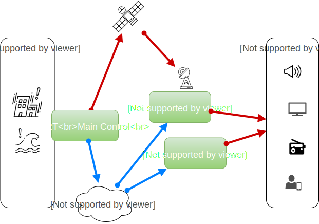

  <a class="button" href="/outsourcing"><i class="fas fa-anchor"></i></a>
  <a class="button" href="/helpdesk">Helpdesk</a>
  <a class="button" href="/on-site">On-site</a>
  <a class="button is-active" href="/process">Process</a>
  <a class="button" href="/training">Training</a>
  <a class="button" href="/website-design">Website</a>
  <a class="button" href="/localization">Localization</a>

## What is J-ALERT?

J-ALERT is Japan’s emergency broadcast system launched in 2007, used to quickly and automatically disseminate information from the government to the public via satellite and an array of equipment set up nationwide, in cases of natural disasters such as earthquakes, tsunami or floods, or attacks on Japan such as missile launches. 

## How does the system work? 

J-ALERT works basically like this: 

1. Fire and Disaster Management Agency (FDMA) receives information about an emergency situation like a tsunami or missile attack. 
2. FDMA East Japan and/or West Japan bureaus transmit emergency information to J-ALERT receiver equipment via satellite and backup terrestrial circuits. 
3. J-ALERT transmitters receive information and relay it nationwide in the form of: 
  * announcements from speakers mounted on towers and buildings
  * alerts on TVs and radios
  * push alerts on mobile phones

 

## Nature of J-ALERT Alerts?

The J-ALERT system sends alerts as follows: 

| Transmission | Alert Type |
| ------------- | ------------- |
| Always Automatic  | Missile Launch, Terrorist Attack, Military Attack, Earthquake, Tsunami, Volcanic Eruption, Weather Emergency etc  |
| Automatic Depending on Location | Regional Details about Earthquake, Tsunami, Volcanic Eruption, Tornado, Flood etc |
| Not Usually Done | Specific River Flood Levels, Weather Warnings, Volcano Warnings etc |

## How can I get J-ALERT Alerts?

The “NHK World TV” app on iOS and Android can receive alerts from the J-ALERT emergency broadcast system, but receiving is on an "opt in" basis. eSolia recommends visitors and residents to install this app from your app store, and in its notification settings, set it to receive quake, tsunami and/or breaking news alerts.  

Please see also our [Japan Emergency Contacts](/japan-contacts) page, for emergency numbers and other useful information.

## Reference

Further reading:

* [J-ALERT Wikipedia Page](https://en.wikipedia.org/wiki/J-Alert)
* [Japan FDMA J-Alert Overview (Japanese)](https://www.fdma.go.jp/html/intro/form/pdf/kokuminhogo_unyou/kokuminhogo_unyou_main/J-ALERT_gaiyou.pdf)
