  <a class="button" href="/outsourcing"><i class="fas fa-anchor"></i></a>
  <a class="button" href="/helpdesk">ヘルプデスク</a>
  <a class="button" href="/on-site">オンサイト</a>
  <a class="button is-active" href="/process">プロセス</a>
  <a class="button" href="/training">トレーニング</a>
  <a class="button" href="/website-design">ウェブサイト</a>
  <a class="button" href="/localization">ローカライゼーション</a>



## J-ALERTとは?

J-ALERTは、全国に設置された衛星や設備を利用して政府から国民へ緊急情報を迅速かつ自動的に伝達するために、2004年に運用開始された日本の全国瞬時警報システムです。 アラートで送信される緊急情報は、地震、津波、洪水などの自然災害関連情報、及び、日本に対するミサイル発射等の武力攻撃情報が含まれております。

## 機能動作の仕組みとは？ 

J-ALERTの機能動作仕組み: 

1. 消防庁 (FDMA) は、津波やミサイル攻撃のような緊急事態に関する情報を受信。
2. 消防庁の関東局と関西局は、衛星および地上回線を介してJ-ALERT受信機に緊急情報を送信。
3. J-ALERT受信機から次のように緊急警報を全国に伝達: 
  * 屋外スピーカー（タワーや建物に設置の防災行政無線）から通知
  * テレビとラジオに警報送信
  * 携帯電話端末へ警報送信

 

## J-ALERTの特徴とは?

J-ALERTシステムの配信情報の種別: 

| 通信判断 | 警報類 |
| ------------- | ------------- |
| 絶対  | ミサイル発射、テロ攻撃、軍事攻撃、地震、津波、火山噴火、気象緊急事態など  |
| 場所による | 地域における地震、津波、火山噴火、竜巻、洪水などの詳細 |
| 通常しない | 特定河川の洪水レベル、気象の警告、火山の警告など |

## J-ALERT警報を受け取るには?

iOSとAndroidの「NHK World TV」アプリは、J-ALERT緊急放送システムからのアラートを受信できますが、受信は「オプトイン」ベースです。 訪日外客と日本居住者の皆様には、アプリストアからこのアプリをインストールし、地震、津波、またはニュース速報のアラート受信で設定することを強くお勧め致します。 

緊急電話番号やその他の役立ち情報については、こちらの [緊急連絡先一覧](/japan-contacts) ページをご覧ください。

## 参照

参考文献:

* ウィキペディア: [J-ALERT 全国瞬時警報システム](https://ja.wikipedia.org/wiki/%E5%85%A8%E5%9B%BD%E7%9E%AC%E6%99%82%E8%AD%A6%E5%A0%B1%E3%82%B7%E3%82%B9%E3%83%86%E3%83%A0)
* [消防庁のJ-Alert概要](https://www.fdma.go.jp/html/intro/form/pdf/kokuminhogo_unyou/kokuminhogo_unyou_main/J-ALERT_gaiyou.pdf)